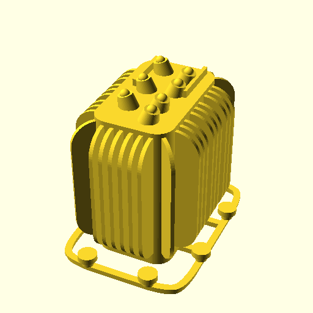

# Miniture scale Transformer

The real size transformer stood next to the transform house of the train station of Alkmaar (The Netherlands). Now this miniature 3D printed model is on display on a miniture model of this train station anno 1950, on the [Modelspoorclub Alkmaar](http://www.modelspoorclubalkmaar.nl/) (Model rail club Alkmaaar).

